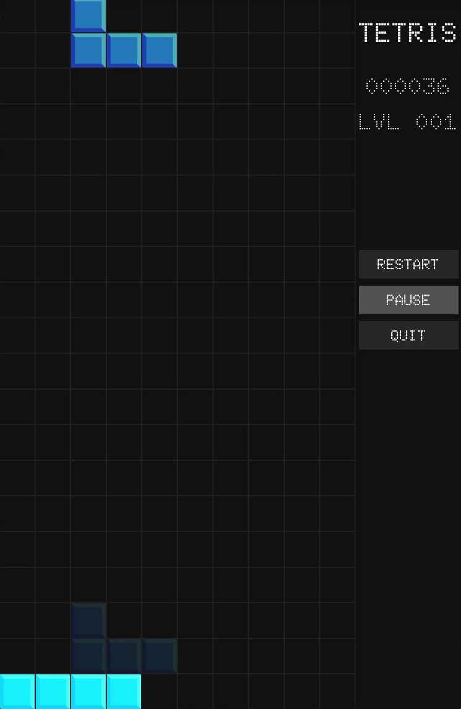

# Tetris

A modern Tetris clone written in **C** using **SDL3**, conforming to the official [Tetris Guidelines](https://tetris.wiki/Tetris_Guideline).

This README serves both as a **usage guide** and a **code walkthrough** for anyone learning SDL.

## DEMO



*(This GIF is sped up to 150% speed)*

---

## 1. Building the project

The project uses **CMake** + **vcpkg (in manifest mode)** and depends on:

* `sdl3`
* `sdl3-image` *(With explicit PNG support)*
* `sdl3-ttf`

### Project Structure

```
project-root/
├── cmake/
│   └── WinFixupBundle.cmake.in
├── include/
├── src/
├── resources/
├── CMakeLists.txt
├── CMakePresets.json
├── vcpkg.json
├── vcpkg-configuration.json
```

### Prerequisites

* A C toolchain (MSVC, clang, or GCC)
* CMake ≥ 3.20
* vcpkg installed and `VCPKG_ROOT` set

NOTE: CMake automatically picks up vcpkg if the VCPKG_ROOT environment variable is set.

### Building with CMake Presets

From the project root:

```sh
cmake --preset vcpkg
cmake --build --preset build-debug
cmake --build --preset build-release
cmake --build --preset package-release
```

The resulting Tetris executable appears in the build directory for your chosen preset.

### Running the Game

Run the built executable from its build folder.
Make sure the **resources/** directory (fonts, textures) is available relative to the executable, as the game loads assets from that path.

---

## How to Play

### Keyboard Controls

* **Move left**: `A` or `←`
* **Move right**: `D` or `→`
* **Rotate clockwise**: `W` or `↑`
* **Soft drop**: `S` or `↓`
* **Hard drop**: `SPACE`
* **Pause / resume**: `P`
* **Quit**: `ESC`

---

## Interesting Implementation Details

A few techniques worth calling out:

1. **Orientation wrapping via bitmask (`& 3`)**

2. **Sliding-window line clearing**

3. **SRS wall-kick tables baked into code**

4. **Grid-first rendering**
   Layout code never cares about pixel sizes, making this compatible with any resolution; window resize only changes `gridSquareSize`.

5. **Cached text rendering for HUD**

---

## 5. Ideas for Extensions

If you want to expand the project, here are natural next steps:

* **Music** (Is it really tetris without music?)
* **Next-piece preview** (bag already supports it)
* **Hold piece**
* **T-Spin detection**
* **Persistent high scores**
* **Settings menu** with key remapping 

The modules are intentionally decoupled making this a great starting point for learning or building a more fully-featured Tetris clone.
